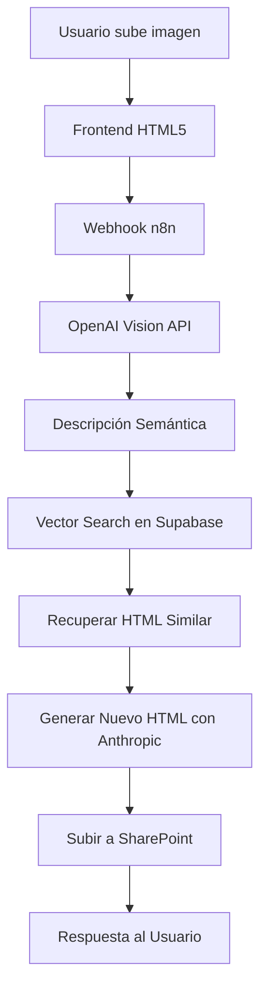
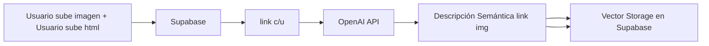
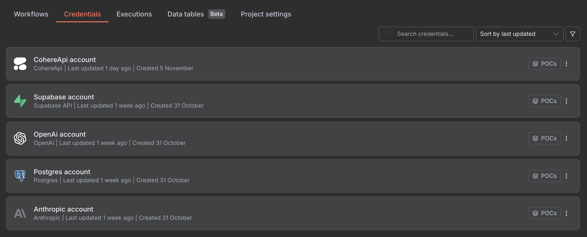
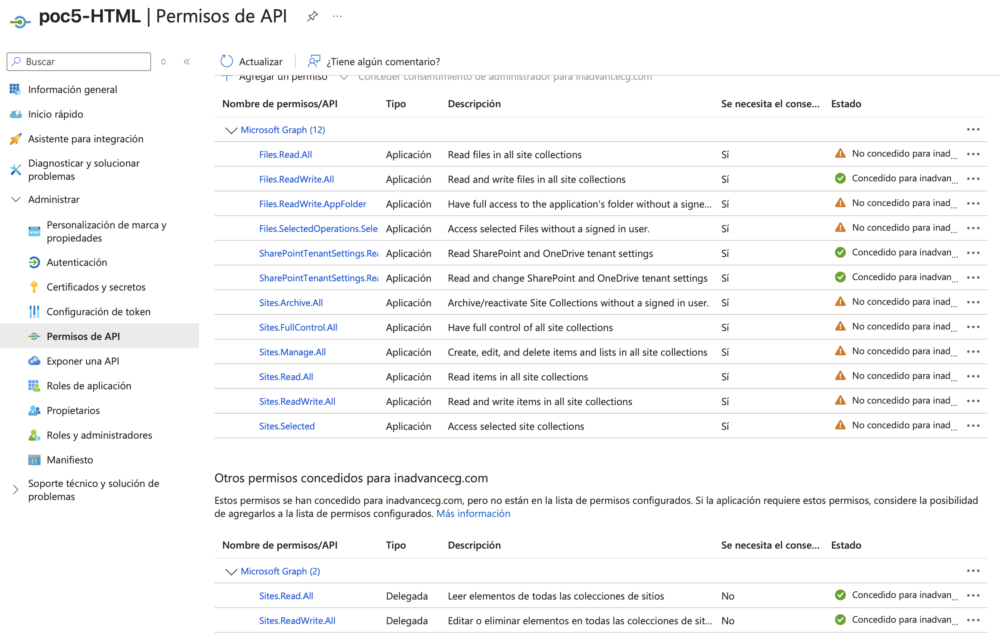
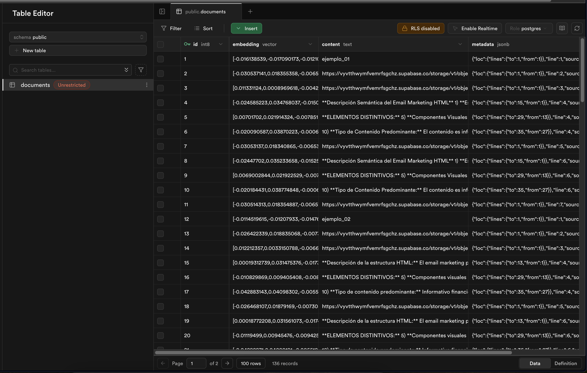

# 🚀 RAG HTML MAILINGS GENERE - Sistema de Automatización con n8n y IA

## 📋 **Descripción del Proyecto**

Sistema de automatización inteligente que utiliza **Retrieval-Augmented Generation (RAG)** para generar código HTML profesional a partir de imágenes de email marketing. El proyecto combina el poder de **n8n**, **OpenAI Vision**, **Anthropic - Clude**, **Supabase Vector Store** y **embeddings semánticos** para crear un flujo de trabajo completamente automatizado que analiza, aprende y genera HTML basándose en patrones visuales similares.

## 🎯 **Objetivo Principal**

Automatizar la generación de código HTML para campañas de email marketing mediante:
- Análisis visual inteligente de imágenes con OpenAI Vision API
- Búsqueda semántica en base de conocimiento vectorial
- Generación contextualizada de HTML basada en ejemplos similares
- Integración con SharePoint para almacenamiento empresarial

## 🏗️ **Arquitecturas**

### **1. Arquitectura del sistema**


Detalles del flujo de trabajo aqui: [Ir a html_3.json - Generación de HTML desde Imágenes](https://github.com/Ferx096/POC5_HTML_mailings/blob/main/flujos.md#2️⃣-html_3json---generación-de-html-desde-imágenes)

                                                                                                                                                    
### **2. Arquitectura del rag**


Detalles del flujo de trabajo aqui: [Ir a RAG_v2.json - Construcción del Vector Store](https://github.com/Ferx096/POC5_HTML_mailings/blob/main/flujos.md#1️⃣-rag_v2json---construcción-del-vector-store)


## 🛠️ Tecnologías Utilizadas

| Componente | Tecnología | Versión/Modelo |
|------------|------------|----------------|
| Orquestación | n8n | Latest |
| BD Vectorial | Supabase PostgreSQL | pgvector |
| Análisis de Imágenes | OpenAI Vision API | GPT-4o |
| Embeddings | OpenAI | text-embedding-3-large |
| Codigo HTML | Antrhopic | Claude Opus 4.1 |
| Reranking | Cohere API | Latest |
| Almacenamiento | SharePoint | Microsoft 365 |
| Frontend | HTML5/CSS3/JavaScript | Vanilla |


## 📁 **Estructura del Proyecto**

```
rag-html-generator/
├── workflows/
│   ├── RAG_v2.json           # Flujo de construcción del vector store
│   └── html_3.json           # Flujo principal de generación HTML
├── frontend/
│   └── index_2.html          # Interfaz de usuario
├── docs/
│   └── README.md             # Documentación
└── examples/
    └── email_templates/      # Ejemplos de HTML almacenados
```


## 🔧 Configuración e Instalación

### Requisitos Previos
```bash
- n8n instalado y configurado
- Cuenta de Supabase con pgvector habilitado
- API Keys:
  - OpenAI API
  - Anthropic
  - Cohere API
  - SharePoint credentials
```


### Paso 1: Microsoft Graph API / SharePoint

| Credencial | Descripcion | Conexion |
|------------|------------|----------------|
| TENANT_ID | Identificador del inquilino Azure AD | TENANT_ID |
| CLIENT_ID | ID de aplicación registrada en Azure | CLIENT_ID |
| CLIENT_SECRET | Secreto de aplicación | CLIENT_SECRET |
| SHAREPOINT_HOSTNAME | nombre host de sharepoint | netorgft4158062.sharepoint.com |
| SHAREPOINT_SITE | nombre del sitio de sharepoint |  RespuestasdeFormulariodetraspasos |

**Variables:**
- Hostname: `netorgft4158062.sharepoint.com`
- Site: `RespuestasdeFormulariodetraspasos`
- Estructura: Permisos de escritura en `/Documentos compartidos/`
- url: `https://graph.microsoft.com/v1.0/sites/{{ $json.id }}/drive/root:/Documentos compartidos/{{ Date.now() }}.html:/content`

**Permisos requeridos:**
- `Sites.ReadWrite.All` - Lectura/escritura en sitios SharePoint
- `Files.ReadWrite.All` - Gestión completa de archivos
- `offline_access` - Tokens de actualización

  


### Paso 2: Configurar Supabase
```sql
-- Habilitar la extensión pgvector
CREATE EXTENSION IF NOT EXISTS vector;

-- Create a table to store your documents
create table documents (
  id bigserial primary key,
  content text, -- corresponds to Document.pageContent
  metadata jsonb, -- corresponds to Document.metadata
  embedding vector(1536) -- 1536 works for OpenAI embeddings, change if needed
);

-- Create a function to search for documents
create function match_search_documents (
  query_embedding vector(1536),
  match_count int default null,
  filter jsonb DEFAULT '{}'
) returns table (
  id bigint,
  content text,
  metadata jsonb,
  similarity float
)
language plpgsql
as $$
#variable_conflict use_column
begin
  return query
  select
    id,
    content,
    metadata,
    1 - (documents.embedding <=> query_embedding) as similarity
  from documents
  where metadata @> filter
  order by documents.embedding <=> query_embedding
  limit match_count;
end;
$$;
```



### Paso 3: Importar Workflows en n8n
1. Importar `RAG_v2.json` para construcción del vector store
2. Importar `html_3.json` para el flujo principal
3. Configurar credenciales en cada nodo

### Paso 4: Configurar el Frontend
```javascript
// Actualizar URL del webhook en index_2.html
const WEBHOOK_URL = 'https://tu-dominio.com/webhook/obtener_imagen';
```

### Paso 5: Ejecutar el Sistema
1. Ejecutar primero [RAG_v2](RAG/RAG_v2.json) para poblar el vector store
2. Activar el webhook de [html_3](json_n8n/html_3.json)
3. Abrir [index_2.html](frontend/index_2.html) en el navegador 


## 📝 Licencia

Este proyecto está licenciado bajo MIT License - ver el archivo [LICENSE](LICENSE) para más detalles.

## 👥 **Autor**

**Fernando Cabrera** - AI Engineer [linkedin](https://www.linkedin.com/in/fernando-cabrera-barranzuela)

---

⭐ Si este proyecto te ha sido útil, considera darle una estrella en GitHub!
