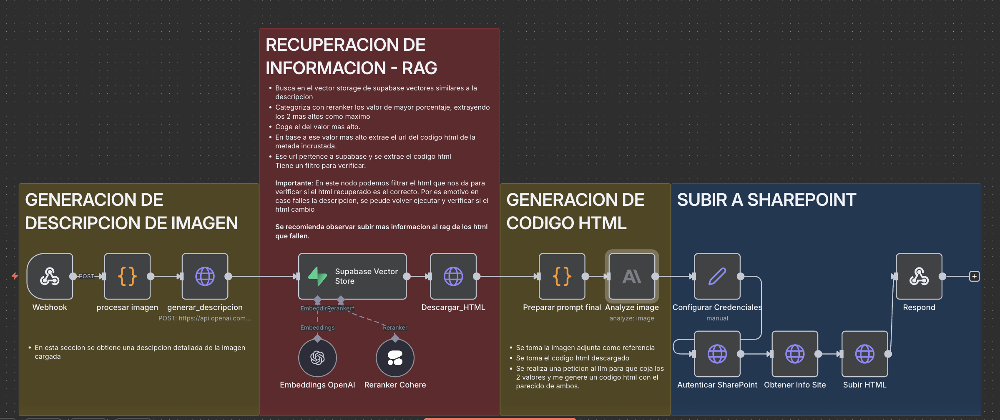

# 🔄 FLUJOS DE TRABAJO

## 1️⃣ **RAG_v2.json - Construcción del Vector Store**

Este flujo es el corazón del sistema RAG y se ejecuta para construir la base de conocimiento:

#### **Paso a Paso:**

1. **Trigger Manual** (`When`)
   - Inicia el proceso de indexación de ejemplos

2. **Preparar Datos URL** (`Preparar_Datos_url`)
   - Carga 10 ejemplos de emails con sus URLs de Supabase
   - Estructura: `example_id`, `screenshot_url`, `html_url`, `tipo_email`

3. **Estructurar Datos Iniciales** (`estructurar_datos_iniciales`)
   - Define el prompt de análisis con 13 criterios semánticos:
     - Estructura HTML observada
     - Identidad única del email
     - Elementos distintivos
     - Contexto diferenciador

4. **Analizar Imagen** (`Analizar Imagen`)
   - Llamada a OpenAI Vision API (GPT-4o)
   - Genera descripción semántica profunda de cada email
   - Temperatura: 0.3 para consistencia

5. **Estructurar Datos Finales** (`Estructurar_datos_finales`)
   - Combina: `example_id`, `html_url`, `image_url`, descripción
   - Prepara metadata para trazabilidad

6. **Embeddings y Vector Store** 
   - **Embeddings OpenAI**: Modelo `text-embedding-3-large` (1536 dimensiones)
   - **Supabase Vector Store**: Almacena vectores con metadata
   - Tabla: `documents` con función de búsqueda `match_documents`

## 2️⃣ **html_3.json - Generación de HTML desde Imágenes**

Flujo principal que procesa las solicitudes del usuario:

#### **Paso a Paso:**

1. **Webhook Endpoint** (`Webhook`)
   - Path: `/obtener_imagen`
   - Método: POST
   - CORS habilitado
   - Recibe imagen en base64

2. **Procesar Imagen** (`procesar imagen`)
   - Valida y limpia datos binarios
   - Convierte a base64 limpio
   - Maneja tipos MIME correctamente

3. **Generar Descripción** (`generar_descripcion`)
   - Analiza la imagen con OpenAI Vision
   - Extrae características visuales y semánticas

4. **Búsqueda Vectorial** (`Supabase Vector Store`)
   - Modo: `load` para búsqueda semántica
   - Top-K: 2 resultados más similares
   - Usa Reranker de Cohere para optimizar resultados

5. **Descargar HTML de Referencia** (`Descargar_HTML`)
   - Obtiene el HTML del ejemplo más similar
   - Usa como base para la generación

6. **Preparar Prompt Final** (`Preparar prompt final`)
   - Combina:
     - HTML de referencia
     - Descripción de la nueva imagen
     - Instrucciones de adaptación

7. **Generar Nuevo HTML** (`Analyze image`)
   - Antrhopic - Claude oppus 4.1 genera HTML adaptado
   - Mantiene estructura pero personaliza contenido

8. **Integración SharePoint**
   - **Configurar Credenciales**: Setup de autenticación
   - **Autenticar SharePoint**: Obtiene token de acceso
   - **Obtener Info Site**: Metadata del sitio
   - **Subir HTML**: Guarda el archivo generado

9. **Responder al Usuario** (`Respond`)
   - Devuelve HTML generado
   - Headers CORS configurados
   - Código 200 con JSON response

## 3️⃣ **index_2.html - Interfaz de Usuario**

Frontend moderno y responsivo con las siguientes características:

#### **Funcionalidades:**
- 📤 **Carga de Imágenes**: Drag & drop o selección manual
- 🖼️ **Preview**: Visualización previa de la imagen
- 📊 **Información del Archivo**: Tamaño, tipo, nombre
- 🔄 **Indicador de Proceso**: Estados en tiempo real
- 📋 **Visor de Código**: Syntax highlighting del HTML generado
- 💾 **Descarga**: Botón para guardar el HTML
- 📱 **Diseño Responsivo**: Adaptable a todos los dispositivos

#### **Validaciones:**
- Tipos de archivo: PNG, JPG, JPEG
- Tamaño máximo: 5MB
- Verificación de conexión con webhook

## 📊 **Características Clave**

### 🎨 Análisis Semántico Profundo
- 13 criterios de análisis por imagen
- Identificación de patrones visuales
- Extracción de elementos distintivos
- Comprensión del contexto empresarial

### 🔍 Búsqueda Inteligente
- Embeddings de 1536 dimensiones
- Búsqueda por similitud coseno
- Reranking con Cohere para precisión
- Metadata enriquecida para filtrado

### 🚀 Optimización y Escalabilidad
- Procesamiento asíncrono
- Cache de embeddings
- Batch processing disponible
- Arquitectura modular
